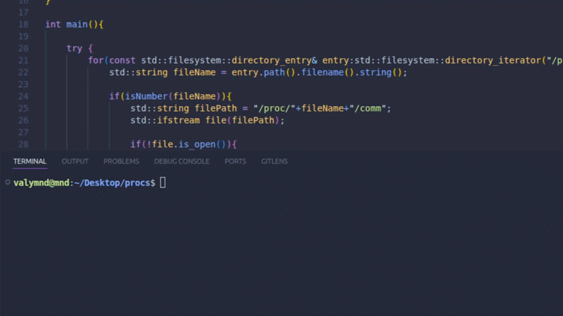

# Procs

### List Running Processes on Debian

The source code of this project is in `main.cpp` file. It is a simple C++ program that uses /proc filesystem to display all running processes in Ubuntu (the PID and process name).



## How to Run

Method 1: Using g++
- download the source code (main.cpp)
- open terminal and navigate to the directory where main.cpp is located
- compile the code using the command: `g++ main.cpp -o procs`
- run the compiled program using the command: `./procs`

Method 2: Get the executable file (Recommended)
- go to the [Releases page](https://github.com/valymndul/procs/releases) of this repository
- download the latest executable file (`procs`) from the **Assets** section
- open terminal and navigate to the directory where you downloaded the file
- make the file executable by running: `chmod +x procs`
- run the program using the command: `./procs`

## Output

When you run the program, it will display a list of all running processes in the following format:

```
PID: 1234, Name: process_name
...
```

Where `PID` is the process ID and `Name` is the name of the process.

## Contributing

Feel free to open an issue or submit a pull request to contribute or suggest features

## License

This project is licensed udner the [MIT LICENSE](LICENSE.md)

### Made for "The Game" event hosted by HackClub


